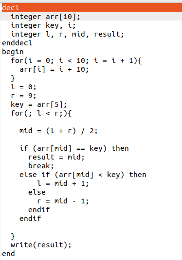

# Basic-Compiler
Basic Compiler for a simple language

> **Warning**  
> This project is currently in progress. Features and documentation may change as development continues.

## Costume Language used


## Declaration
### declarations are done between the tags:
```plaintext
decl
    // Variable declarations
enddecl
```

## DataTypes:

* ### integet
* ### string
* ### float
* ### char

## Operations:

* ### Arithmetic: ADD, SUB, MULT, DIV

* ### Comparison: ==, >=, <=, !=

* ### Logical: !, | (Logical OR), & (Logical AND)

## Statement List:

### The language supports the following statements:

* ###    For statement

* ###    IF statement

* ###    IF ELSE statement

* ###    WHILE statement

* ###    BREAK statement

* ###    ASSIGN statement

* ###    WRITE statement